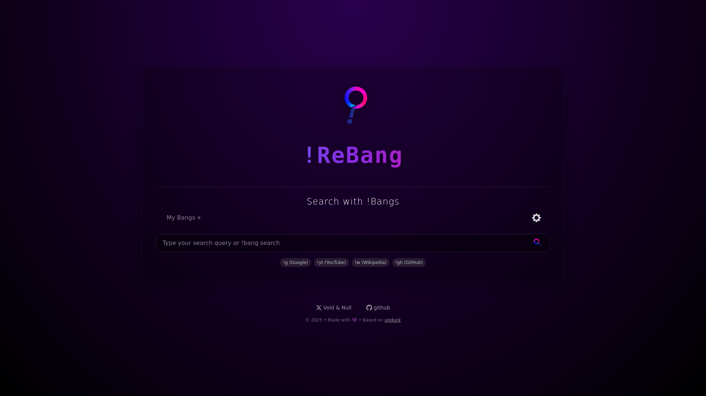

# **!ReBang**

## [Rebang.Online](https://rebang.online)

An enhanced, feature-rich fork of [unduck](https://github.com/t3dotgg/unduck) that makes DuckDuckGo's bang redirects lightning fast while adding powerful new features and a modern interface.

## Modern, Intuitive Interface

**!ReBang** features a clean, modern UI that makes searching with bangs more enjoyable:

* Sleek, responsive design that works on all devices
* Dark mode default
* Visual feedback during searches

## Intelligent Search with Bang Discovery

The search bar on the **!ReBang** home page does more than just accept queries:

* **Bang autocomplete** - Discover new bangs as you type with intelligent suggestions
* **Visual indicators** - See which bangs are available for your current query
* **Instant feedback** - Know exactly where you'll be redirected before pressing Enter

## Expanded Bang Collection

**!ReBang** goes beyond DuckDuckGo's bang collection:

* **AI-focused bangs** - Quickly access ChatGPT (`!chat`), Claude (`!claude`), Perplexity (`!perp`), and other AI assistants
* **Curated collection** - Our bang list is regularly audited to remove dead links that DuckDuckGo hasn't maintained
* **Community suggestions** - New bangs are added based on user requests and usage patterns
## How to Use

1. **As a Custom Search Engine:**
   - Go to https://rebang.online/ to configure **!ReBang** to your preferences. (Default Search)
   - Add the URL `https://rebang.online/?q=%s` to your browser's custom search engines
   - Set **!ReBang** as your default search engine.
   - Type your search, include a bang `!g` `!yt` `!w` somewhere in the seach, and **!ReBang** will reroute your request to where you want to search.

2. **Direct Use:** 
   - Visit the website directly https://rebang.online/
   - Use the search bar to enter your bang commands
   - Get redirected instantly to your destination

## How **!ReBang** Improves on DuckDuckGo and unduck

| Feature | DuckDuckGo | unduck | **!ReBang** |
|---------|------------|--------|---------|
| Fast Redirects | ❌ (Server-side) | ✅ (Client-side) | ✅ (Client-side) |
| Modern UI | ✅ | ❌ | ✅ |
| Bang Autocomplete | ✅ | ❌ | ✅ |
| AI-focused Bangs | ❌ | T3 Only | ✅ |
| Maintained Bang List | Partially | ❌ | ✅ |
| No White Flash for Dark Mode Users | ❓ | ❌ | ✅ |

## Why **!ReBang**?

* **Speed**: Redirects happen instantly on your device without server latency
* **Discovery**: Find useful new bangs you never knew existed
* **Reliability**: Dead links are regularly pruned from our bang collection
* **Privacy**: Your searches stay on your device - we don't track anything
* **Modern**: Sleek and Simple.
* **Dark Mode Friendly**: Fixed the white flash issue during redirects that affected dark mode users in unduck
* **Community-driven**: Actively maintained and improved based on user feedback